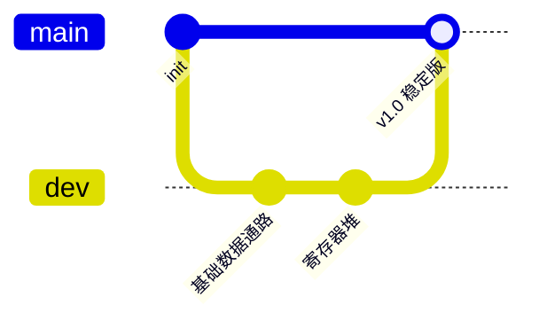
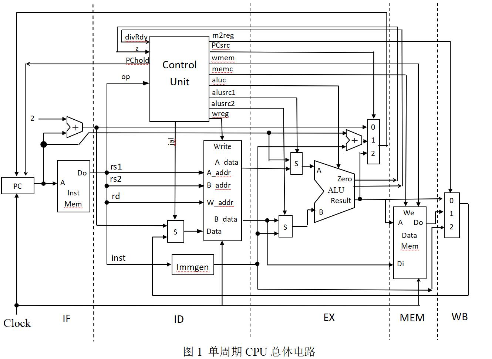
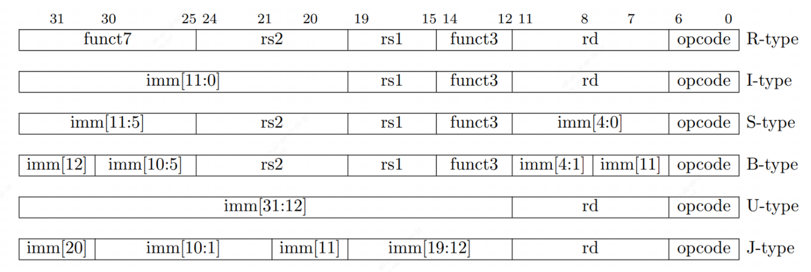
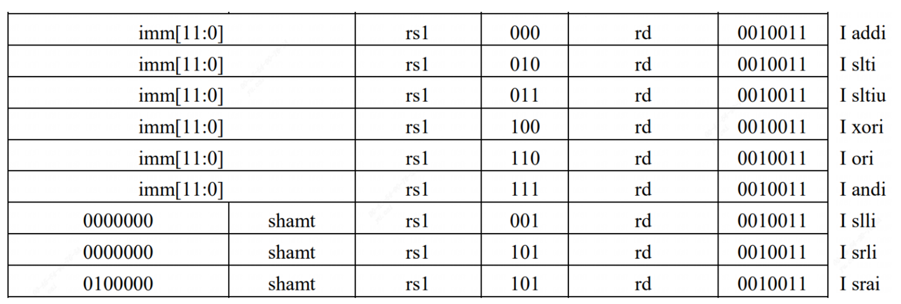
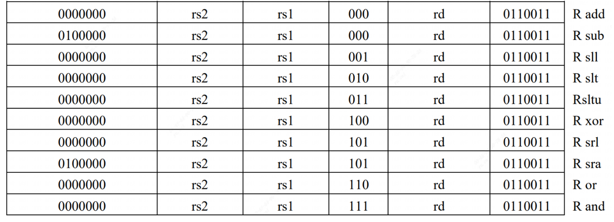
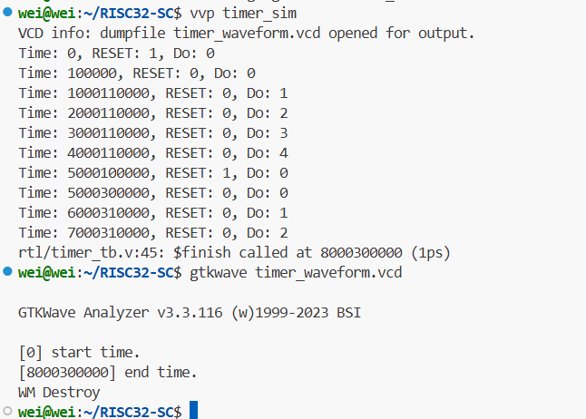
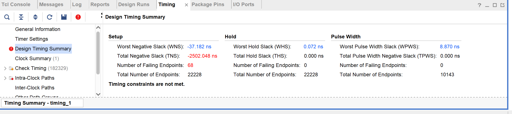
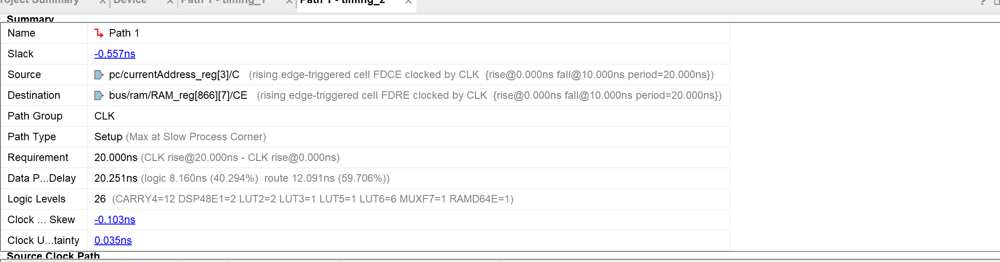

# RISC32-SC


## 项目简介

RISC32-SC 是一个基于 **自定义指令集架构（ISA）** 的 **32 位 RISC 单周期 CPU** 硬件设计与实现项目。  
本项目从指令集设计、数据通路构建到控制逻辑实现，完整展示了一个处理器从理论到硬件的实现过程。  


### 项目特性

- **自定义 ISA**：包含算术、逻辑、存储访问与分支跳转等基础指令  
- **单周期设计**：每条指令在一个时钟周期内完成执行  
- **模块化实现**：数据通路、控制单元、寄存器堆、存储器等独立设计，便于扩展  
- **可仿真与验证**：支持在仿真工具中运行测试程序，验证指令正确性  
- **可综合部署**：设计可在 FPGA 上实现  


### 项目结构

 ├── assmbler/          # 汇编器和汇编程序代码
 ├── doc/          # 文档（ISA 说明、设计思路、时序图等）
 ├── images/         # 项目说明所需要的图片
 ├── rtl/          # 项目设计文件的Verilog 源码
 ├── simulation/          # 仿真代码与测试用例
 ├── test/         # c语言编译产生的bin文件和传输程序
 ├── transport/         # 除法发送接收程序和程序动态下载程序
 ├── XDC/         # 约束文件
 └── README.md     # 项目说明


### 快速开始

1. 克隆仓库

```bash
git clone https://github.com/xuan361/RISC32-SC.git
```

1. 打开 `sim/` 文件夹，在仿真工具（Vivado Simulator）中运行测试
2. 查看 `doc/` 目录下的 ISA 规范与数据通路设计说明


### 开发环境

- **硬件描述语言**：Verilog HDL
- **仿真工具**： Vivado


### 开发流程




### RISC-V 指令集特性

#### 核心特点

RISC-V 是一个基于精简指令集计算（RISC）原则的开源指令集架构（ISA）。

- **开源免费**: 无需支付专利费用即可自由使用。
- **模块化设计**: 拥有固定的基础指令集（如RV32I），并可通过标准扩展（如M、A、F、D等）增加功能。
- **可扩展性**: 支持用户自定义指令，适用于特定领域加速。

#### 实现的指令集

本项目CPU核心基于 **RV32IM** 指令集：

- **RV32I**: 基础的32位整数指令集。本项目实现了除ECALL/EBREAK、FENCE及CSR指令外的37条指令。
- **RV32M**: 整数乘法和除法标准扩展指令。


## 总设计图



## 状态机

```verilog
    localparam S_WAIT_COUNT    = 4'b0001; // 等待接收指令总数的低字节 1
    localparam S_WAIT_COUNT_MSB    = 4'b0010; // 等待接收指令总数的高字节 2
    localparam S_LOADING_INSTR_LSB = 4'b0011; // 等待接收指令的低字节 3
    localparam S_LOADING_INSTR_MSB = 4'b0100; // 等待接收指令的高字节 4
    localparam S_LOAD_DONE         = 4'b0101; // 加载完成，等待启动 5
    localparam S_RUNNING           = 4'b0110; // CPU运行 6
	localparam S_WAIT_DATA         = 4'b0111; // 等待传输数据 7
```


## 功能部件

### 指令寄存器

- 输入：A

- 输出：op, rd, rs1, rs2, instruction

所有指令长度为32位，采用小端模式存储。主要格式如下：



```
opcode(操作码)：指令的基本操作，这个缩写是它惯用名称。
rd：目的操作寄存器，用来存放操作结果。
funct3：一个另外的操作码字段。
rs1：第一个源操作数寄存器。
rs2：第二个源操作数寄存器。
funct7：一个另外的操作码字段。
imm：立即数
```


### PC

- 输入： CLK, RESET, PCHold,  newAddress, 
- 输出： currentAddress


### immGen




```verilog
ADDI rd, rs1, imm: 将寄存器rs1中的值加上立即数imm，结果存储在rd。立即数imm是12位，其中最高位是符号位。如果imm[11]为1，则需要进行符号扩展，将imm扩展到32位。
ANDI rd, rs1, imm: 寄存器rs1和立即数imm按位与，结果存储在rd。imm也是12位，并遵循同样的符号扩展规则。
ORI rd, rs1, imm: 寄存器rs1和立即数imm按位或，结果存储在rd。立即数imm同样为12位，且根据最高位决定是否进行符号扩展。
XORI rd, rs1, imm: 寄存器rs1和立即数imm按位异或，结果存储在rd。立即数imm的处理方式相同。
SLLI rd, rs1, shamt: 寄存器rs1左移shamt位（逻辑左移），结果存储在rd。shamt是立即数但仅使用低5位（对于RV32I）。
SLTI rd, rs1, imm: 如果rs1小于立即数imm（有符号比较），则rd设置为1，否则设置为0。imm为12位并可能需要符号扩展。
SLTIU rd, rs1, imm: 如果rs1小于立即数imm（无符号比较），则rd设置为1，否则设置为0。imm的处理方式同上。
SRLI/SRAI rd, rs1, shamt: 寄存器rs1右移shamt位（逻辑/算术右移），结果存储在rd。shamt是立即数但仅使用低5位（对于RV32I）。SRAI会考虑符号位进行扩展，而SRLI不会。
```


### ALU

**R型指令包括加法、减法、逻辑运算、移位运算**



```verilog
ADD rd, rs1, rs2: 将寄存器rs1和rs2中的值相加，结果存储在rd。
SUB rd, rs1, rs2: 从寄存器rs1中减去寄存器rs2的值，结果存储在rd。
AND rd, rs1, rs2: 寄存器rs1和rs2按位与，结果存储在rd。
OR rd, rs1, rs2: 寄存器rs1和rs2按位或，结果存储在rd。
XOR rd, rs1, rs2: 寄存器rs1和rs2按位异或，结果存储在rd。
SLL rd, rs1, rs2: 寄存器rs1左移rs2位（逻辑左移），结果存储在rd。
SLT rd, rs1, rs2: 如果rs1小于rs2（有符号比较），则rd设置为1，否则设置为0。
SLTU rd, rs1, rs2: 如果rs1小于rs2（无符号比较），则rd设置为1，否则设置为0。
SRL rd, rs1, rs2: 寄存器rs1右移rs2位（逻辑右移），结果存储在rd。
SRA rd, rs1, rs2: 寄存器rs1右移rs2位（算术右移），结果存储在rd。
```

| 指令类型 | 输入是否取绝对值     | 输出修正              |
| -------- | -------------------- | --------------------- |
| `DIV`    | 两数取绝对值参与除法 | 商取符号（rs1 ^ rs2） |
| `DIVU`   | 不取绝对值           | 商直接输出            |
| `REM`    | 两数取绝对值参与除法 | 余数取符号（rs1）     |
| `REMU`   | 不取绝对值           | 余数直接输出          |

### RegisterFile 寄存器组

- **32个通用寄存器 (x0-x31)**: 每个寄存器宽度为32位。

```
x0 (zero) ：硬连线为常数0，任何写入此寄存器的操作都会被忽略。
x1 (ra) ： 保存返回地址，用于函数调用后返回
x2 (sp) ： 栈指针，指向当前栈顶。
x3 (gp) ： 全局指针，用于访问全局数据区。
x4 (tp) ： 线程指针，可用于多线程环境下的线程本地存储。
x5-x7 (t0-t2) - 临时寄存器，可以由调用者自由使用。
x8-x9 (s0-s1, fp) - 已保存寄存器/帧指针，需要由调用者保存和恢复。
x10-x11 (a0-a1) - 函数参数/返回值，用于传递前两个整型或指针参数。
x12-x17 (a2-a7) - 函数参数，用于传递更多的参数。
x18-x27 (s2-s11) - 已保存寄存器，需要由调用者保存和恢复。
x28-x31 (t3-t6) - 临时寄存器，可以由调用者自由使用。
```

### DataMemory

​	**小端模式**：传入的数据低位要放在索引值小的存储单元里

- 内存：1字节为单位
- 寄存器：4字节为单位


## 指令列表

#### RV32I 基础指令集

- **R-type**
  - `add`, `sub`, `sll`, `slt`, `sltu`, `xor`, `srl`, `sra`, `or`, `and`
- **I-type (立即数运算)**
  - `addi`, `slti`, `sltiu`, `xori`, `ori`, `andi`, `slli`, `srli`, `srai`
- **I-type (Load)**
  - `lb`, `lh`, `lw`, `lbu`, `lhu`
- **S-type (Store)**
  - `sb`, `sh`, `sw`
- **B-type (条件跳转)**
  - `beq`, `bne`, `blt`, `bge`, `bltu`, `bgeu`
- **U-type**
  - `lui`, `auipc`
- **J-type & I-type (无条件跳转)**
  - `jal`, `jalr`

#### RV32M 扩展指令集

**R-type**

- `mul`: 乘法，取结果低32位。
- `mulh`: 有符号乘法，取结果高32位。
- `mulhsu`: 有符号与无符号数相乘，取结果高32位。
- `mulhu`: 无符号乘法，取结果高32位。
- `div`: 有符号除法。
- `divu`: 无符号除法。
- `rem`: 有符号取余。
- `remu`: 无符号取余。

## 仿真测试

### 工作时间计数器




## 硬件系统设计

### 单周期CPU核心

CPU被设计为一个单周期处理器，即一条指令在一个时钟周期内执行完毕。

> **注意**: M扩展中的除法指令 (`div`, `divu`, `rem`, `remu`) 是一个例外。由于除法运算的复杂性，它需要多个周期。在执行除法指令时，控制单元会发出`PChold`信号暂停PC更新，直到ALU中的除法器完成计算并发出`divRdy`信号。

### SoC系统架构

CPU核心通过一条 **RISC-V内部总线 (RIB)** 与多个外设连接，形成一个完整的SoC系统。存储器和外设采用统一编址。

- **RIB总线信号**:
  - **地址总线 (Address Bus)**: 传输CPU访问的地址。
  - **数据总线 (Data Bus)**: 双向传输读写数据。
  - **控制信号 (wr_en)**: 写使能信号。

#### 地址空间分配

本项目设计的SoC共挂载5个外设，每个外设空间大小为256MB。

| 起始地址      | 设备  | 大小  |
| ------------- | ----- | ----- |
| `0x4000_0000` | GPIO  | 256MB |
| `0x3000_0000` | UART  | 256MB |
| `0x2000_0000` | Timer | 256MB |
| `0x1000_0000` | RAM   | 256MB |
| `0x0000_0000` | ROM   | 256MB |

### 系统组件详解

#### 1. 控制单元 (Control Unit)

- **功能**: 根据指令的`opcode`字段生成CPU内部所有模块的控制信号。
- **输入**:
  - `op`: 来自指令的7位操作码。
  - `divRdy`: 来自ALU的除法完成信号。
- **输出**:
  - `PChold`: PC保持信号，用于多周期除法。
  - `PCsrc`: PC更新来源选择信号。
  - `wmem`: 数据存储器写使能。
  - `memc`: 访存控制相关信号。
  - `aluc`: ALU操作选择信号。
  - `alusrc`: ALU第二操作数来源选择信号。
  - `wreg`: 寄存器堆写使能。

#### 2. 算术逻辑单元 (ALU)

- **功能**: 执行算术和逻辑运算，包括加减、移位、逻辑与/或/异或、比较以及乘除法。
- **输入**:
  - `A`: 来自`rs1`寄存器的数据。
  - `B`: 来自`rs2`寄存器或立即数生成器的数据。
  - `aluc`: 来自控制单元的操作选择信号。
- **输出**:
  - `Result`: 32位运算结果。
  - `Zero`: 零标志位，用于B-type指令判断。
  - `divRdy`: 除法完成信号 (仅M扩展)。

#### 3. Timer

- **功能**: 提供一个32位的计数器，用于计时。
- **寄存器**:
  - **地址偏移 `0x0`**: 32位计数器，计数单位为毫秒。

#### 4. GPIO (通用输入/输出)

- **功能**: 控制LED灯组和数码管组的显示。
- **寄存器**:
  - **地址偏移 `0x0`**: 8位LED灯组控制寄存器，每位对应一个LED灯。
  - **地址偏移 `0x1` ~ `0x7`**: 6个数码管的控制寄存器，每个寄存器8位宽。

#### 5. UART (通用异步收发器)

**功能**: 实现串行通信。

**寄存器**: 

| 偏移地址 | 寄存器名称    | 功能描述                                                     |
| -------- | ------------- | ------------------------------------------------------------ |
| `0x00`   | `UART_CTRL`   | 控制寄存器。bit0: 发送使能; bit1: 接收使能。                 |
| `0x04`   | `UART_STATUS` | 状态寄存器。bit0: 发送忙标志 (1为忙); bit1: 接收完成标志 (1为完成)。 |
| `0x08`   | `UART_BAUD`   | 波特率设置寄存器。                                           |
| `0x0c`   | `UART_TXDATA` | 发送数据寄存器。                                             |
| `0x10`   | `UART_RXDATA` | 接收数据寄存器。                                             |

​                                                                                                                           

## 软件与验证

- **工具链**: 使用 **GNU RISC-V32 GCC** 编译开发工具进行C语言和汇编程序的开发。
- **验证程序**: 编写了三个示例程序来验证SoC系统的完整功能：
  1. **流水LED灯**: 验证GPIO的写操作功能。
  2. **时钟显示**: 验证Timer的读操作和GPIO数码管的写操作功能。
  3. **使用UART显示字符串**: 验证UART的发送功能。


## Question

- 


## TODO

- 


## 参考

|       主题       |                             链接                             |
| :--------------: | :----------------------------------------------------------: |
| 关于流水线的优势 | https://blog.csdn.net/weixin_75067193/article/details/133852299 |
|                  |                                                              |
|                  |                                                              |

## Q&A

> ### 如果一个模块的最终输出 (`Result`)，在不同情况下依赖于时序逻辑和组合逻辑的结果，应该怎么处理？

**解决方案：使用一个由状态信号控制的多路选择器（multiplexer）来为最终输出选择正确的结果。**

**1. 两条独立的计算路径**

 ALU 通过两种方式计算结果：

- **组合逻辑路径 (`comb_result`)**: 对于简单的单周期操作（如 `ADD`, `SUB`, `AND`, `OR` 等），其结果在 `always @(*)` 块内是瞬时计算出来的 。这个结果存储在 `comb_result` 寄存器中。乘法逻辑也被实现为组合逻辑，可以在同一个周期内提供结果 。
- **时序逻辑路径 (`seq_result`)**: 对于复杂的多周期操作（除法和求余），代码使用了一个有限状态机（FSM）。状态机在多个时钟周期内逐步从一个状态（`FSM_IDLE` , `FSM_BUSY` , `FSM_DONE` ）迁移到另一个状态，以完成计算。这个复杂过程的最终结果存储在 `seq_result` 寄存器中 。

**2. 将状态机作为控制器**

有限状态机（FSM）是整个操作的核心控制器。它决定了哪个结果是有效的。

- 当除法或求余操作开始时，状态从 `FSM_IDLE` 转换到 `FSM_BUSY` 。
- 计算过程会持续多个周期（在此代码中为32个周期）。
- 最关键的一步是，当计算完成时，状态机会进入 `FSM_DONE` 状态并保持一个周期 。这个“完成”信号正是选择输出结果的关键。
- 在 `FSM_DONE` 状态之后，它会返回到 `FSM_IDLE` 状态 。

**3. 使用多路选择器选择最终输出**

最后，也是最重要的一环，就是通过一行代码实现选择逻辑。这条 `assign` 语句的作用相当于一个二选一的多路选择器：

```Verilog
// 如果是除法/求余操作且已完成，则输出时序逻辑的结果(seq_result)
// 否则，直接输出组合逻辑的结果(comb_result)
assign Result = (state == FSM_DONE) ? seq_result : comb_result; 
```

**工作原理如下：**

- **选择信号 (Selector)**：条件 `(state == FSM_DONE)` 是输入到多路选择器的选择信号。

- **输入 1**: 当选择信号为真时（即多周期操作刚刚完成），选择 `seq_result` 作为输出 。

- **输入 0**: 当选择信号为假时，选择 `comb_result` 作为输出 。这包含了所有单周期操作以及多周期操作正在进行中的情况。

**4. 设计模式总结**

当一个模块的最终输出需要根据不同情况依赖于组合逻辑或时序逻辑时，可以遵循以下步骤：

1. **分离逻辑**：创建独立的逻辑路径。为即时结果使用组合逻辑块（`always @(*)` 或 `assign`），为多周期结果使用带状态机的时序逻辑块（`always @(posedge CLK)`）。
2. **存储结果**：将组合逻辑路径的输出存储在一个寄存器中（例如 `comb_result`），并将时序逻辑路径的最终输出存储在另一个寄存器中（例如 `seq_result`）。
3. **生成“完成”信号**：在你的状态机中使用一个特定的状态（例如 `FSM_DONE`）来明确指示时序逻辑的计算已完成，其结果已准备好可以输出。
4. **复用输出**：使用一个条件 `assign` 语句（三元运算符）来创建一个多路选择器。该选择器利用来自状态机的“完成”信号，来决定两个结果寄存器中哪一个来驱动模块的最终输出端口。


> ### 发送数据程序仿真通过，但是上板测试没有通过

**问题详情**：直接将寄存器中的值存入Uart的发送数据寄存器，数据能够正常通过串口发送，但是当lb,sb经过ram暂存再存入Uart的发送数据寄存器，数据通过串口只发送1

**猜测1：**Ram在复位时有将1024个寄存器置为0的操作，复位同时也是cpu工作的标志，会不会一个时钟周期无法实现全部置为0而导致**时序混乱**？

- 措施：删除复位将1024个寄存器置为0的操作，重新上板测试
- 结果：问题依然存在

**猜测2**：进行**时序检查**，获得时序报告显示：

- 

  - **`WNS = -37.182 ns` 的意思是：** 在设计中，那条**最慢的逻辑路径**（关键路径），比时钟要求的时间**慢了 37.182 纳秒**。

  - **这是什么概念？** 假设你的时钟是100MHz，一个周期只有`10 ns`。你的这条路径需要 `(10 + 37.182) ns` 才能跑完。这根本不可能工作。

- 分析Uart.v的代码发现

  ```verilog
      // -- 波特率时钟分频器计算 --
      reg [31:0] clk_div;
      always @(*) begin
          // 根据波特率寄存器的值计算每个比特需要持续的时钟周期数
          if (uart_baud != 0)
              clk_div = SYS_CLK_FREQ / uart_baud;
          else
              clk_div = SYS_CLK_FREQ / DEFAULT_BAUD; // 如果未设置，则使用默认值
      end
  ```

  为了在硬件中实现一个32位的除法器，综合工具 (Vivado) 必须生成一个**极其庞大和缓慢**的纯组合逻辑电路，最致命的是由于没有运行条件，无时无刻都在进行计算。

- 措施：**修改计算 clk_div的逻辑，改为更新 uart_baud 时再进行重新计算**

  ```verilog
  case(A_UART[4:0]) // 根据地址偏移选择寄存器
      5'h00: uart_ctrl   <= Di;
      5'h08: begin
          uart_baud   <= Di;
          if(Di != 0)
              clk_div <= SYS_CLK_FREQ / Di;
          else 
              clk_div <=  32'd5208;
      end
  ```

- **结果：由组合逻辑除法器引起的 `76 ns` 的延迟消失，时钟延迟明显降低，上板依然失败，**

  

**猜测3**: Ram内部耗时过大

- 时序报告显示：**`route 12.091ns (59.706%)`**。这意味着**60%** 的时间都花在信号在芯片内部的“赶路”上。

  

- 分析：1024 个 8位寄存器（8192个触发器）铺在 FPGA 芯片上，占用了很大一块面积，信号从 CPU 核心传到 RAM 的最远端，物理距离很长，导线延迟（Route Delay）很高。
- **修改：将Ram寄存器数量由1024改为256个**
- **结果：上板成功，能够正确发送预期数据。**


