# 软工提纲

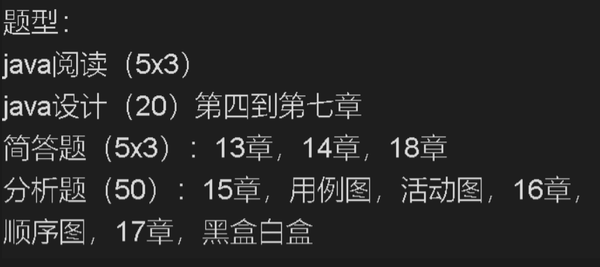

## 1-3

java语言的特点：

- 简洁性
- 面向对象
- 安全性
- 平台无关性（编译器所生成的可执行代码是基于抽象处理器─Java虚拟机(JVM：Java Virual Machine)来实现的，Java虚拟机就是虚拟运行Java代码的假想计算机，其定义为：运行经过编译的Java目标代码的计算机的实现。）
- （动态性、高性能、多线程、分布式）

java的基本结构：

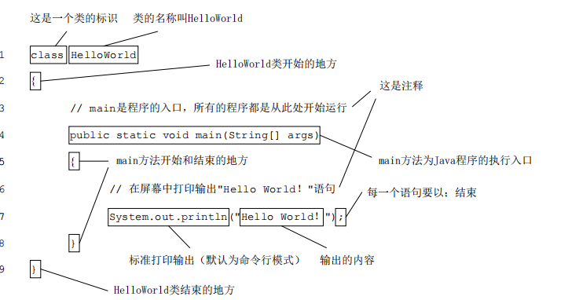

java虚拟机：

Java虚拟机(JVM：Java Virtual Machine)是虚拟运行Java代码的假想计算机。Java编译程序是将Java的源程序编译成JVM可执行代码

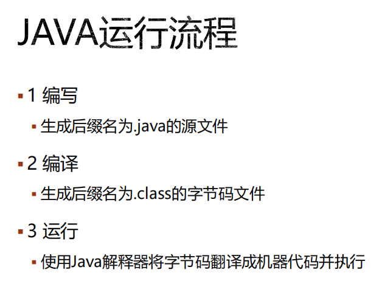

java程序结构：

源程序为一个或多个.java文件

源程序的三个基本部分：

- **一个**包声明语句package（可选）
- 任意个import'语句（可选）
- 类与接口声明（**至少一个**）

（具有顺序性）

p.s在一个Java源程序中，只能有一个类可以被声明为public(公共)类。若某个类中有

main()方法，则声明该类为public类

java所使用的符号集：

Java采用的是Unicode码，又称统一码字符集，使用16位存储空间，支持多种语言，更具有国际化特性；

▪ 当Unicode中的高8位为0时，则低8位的编码与ASCII码相同。

▪ ASCII码是用8位存储空间。

java关键字、标识符：

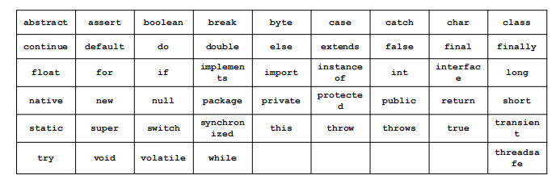

（标识符取名：▪ 必须由字母、下划线或美元符开头的；

▪ 并由字母、数字、下划线和美元符组成的；

▪ 不能与关键字同名；）

java数据类型：

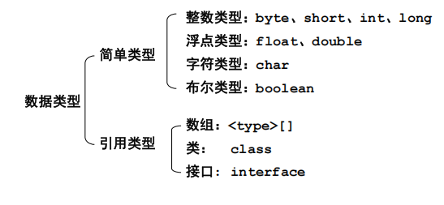

**引用类型**(数组、class或interface)声明变量时，是不会为变量(即对象)分配存储空间。它们声明的变量不是数据本身，而是数据的引用(reference)，需用new运算符来为引用类型的变量分配贮存空间.引用类型的变量通过点“·”运算符访问它的成员。

变量声明与作用域：

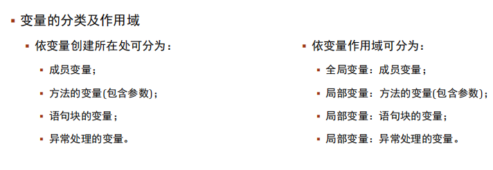

运算符及表达式：

大部分与C等相同，注意：

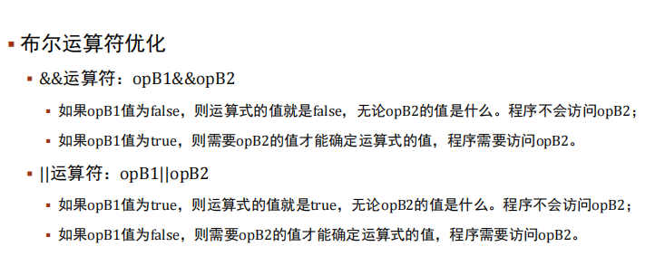


数组和字符串：

声明与**实例化**

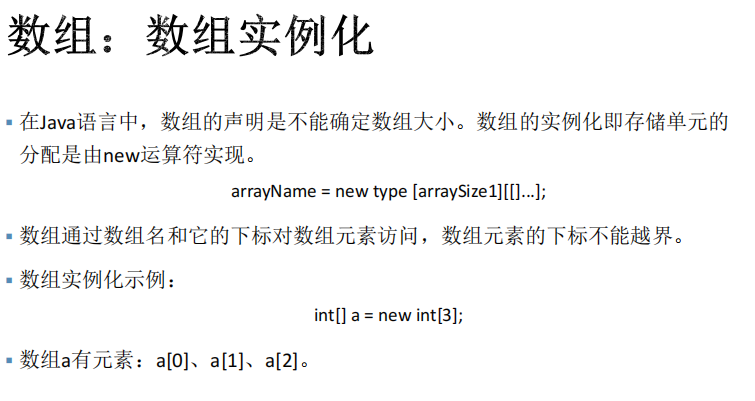

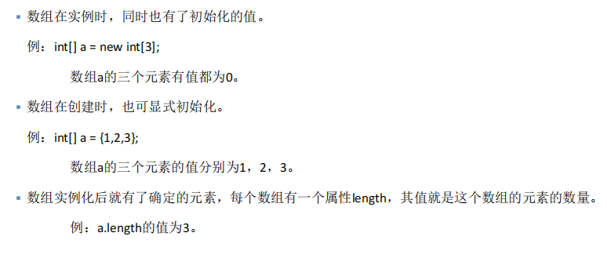

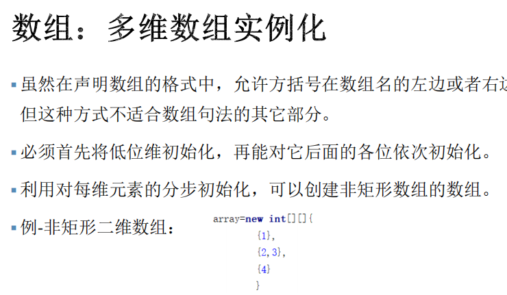

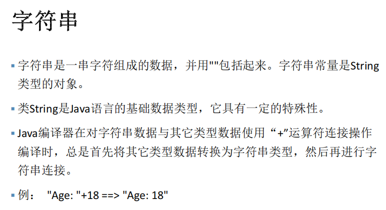

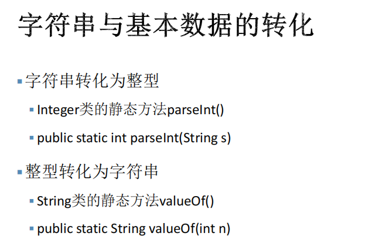

## 4

1. 面向对象设计的基本原理：

依照现实世界的实体的特点，把复杂的现实的事物按它们所共有的状态和行为抽象并封装。

- 封装性
- 继承性
- 多态性

对象是一个数据模块，是抽象出来的某个类的一个实例

消息是对象对自身方法的调用，一个消息就是一个对象方法的调用

类定义了对象的类型

2. 类的声明组成及各部分原理：

   一个类包含三个部分：

   - 类声明
   - 类成员
   - 类构造器（方法）

   类的体包含：成员变量、成员方法、构造方法

   p.s 

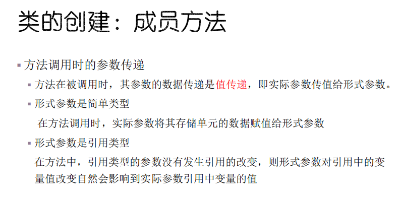

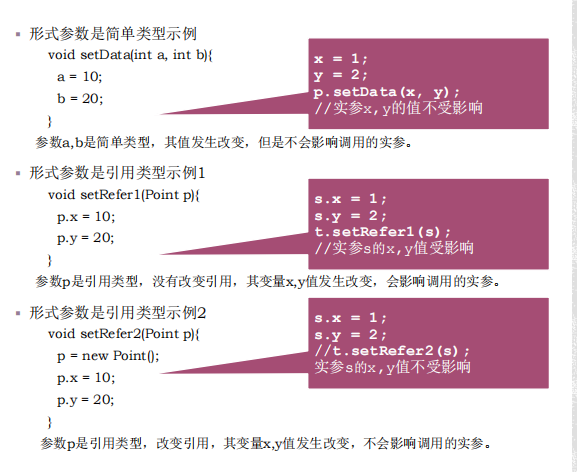

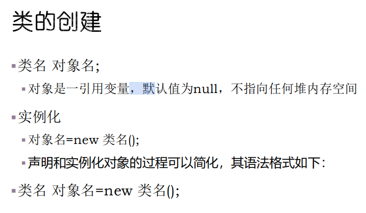

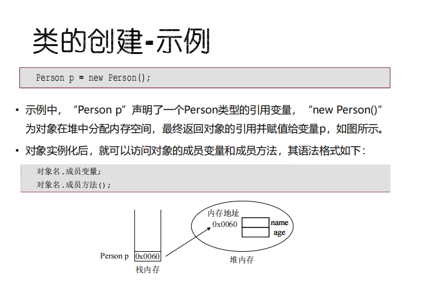

3.方法过载：

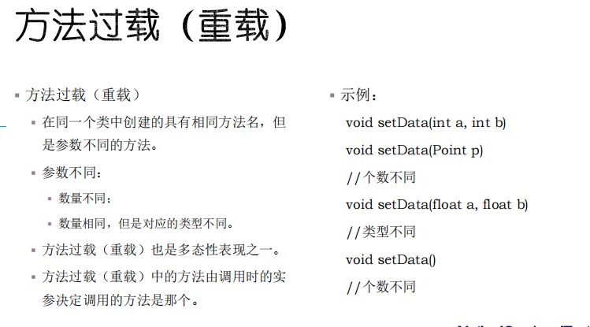

4.类的构造方法及成员变量初始化：

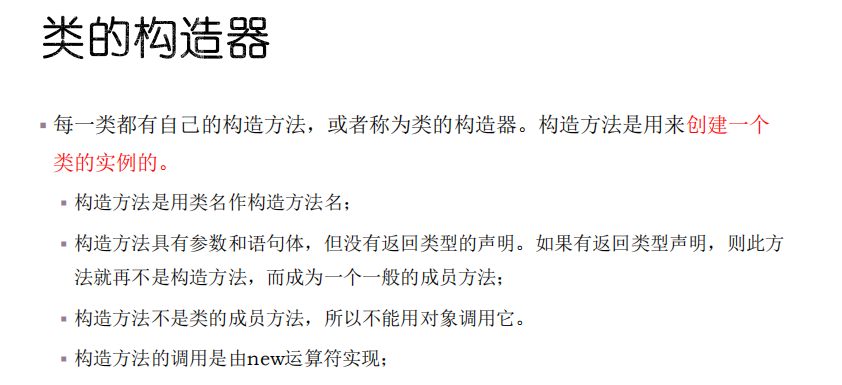

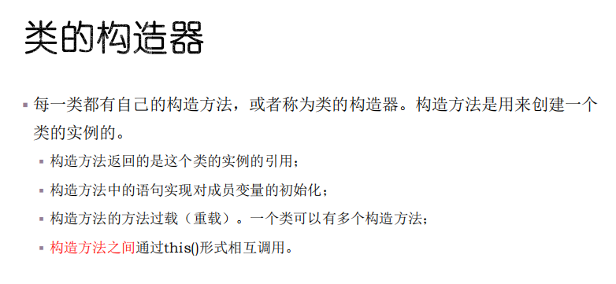

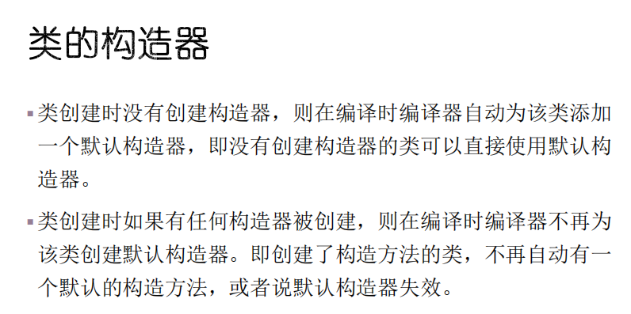

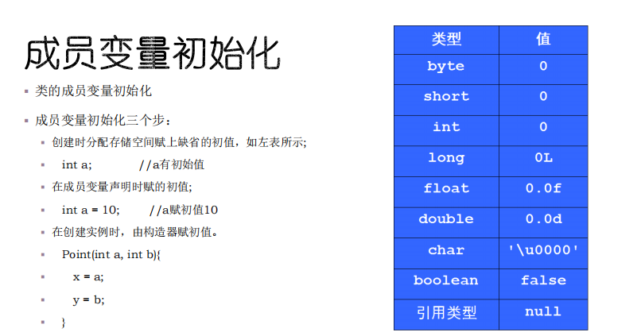

5.类成员和实例成员：

static关键字：

- 将成员以static修饰，则此成员不会与此类的任何对象实例相联系
- static方法不需创建对象，也无法简单的调用同一个类的成员变量（仅能调用其它static数据、方法、不能引用super、this）

类成员：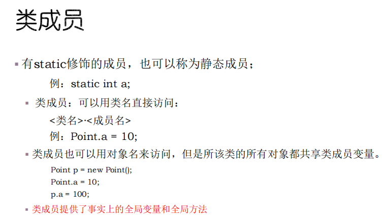

实例成员：

p.s.

6.对象的创建使用清除与生命周期：

生命周期：创建、使用、销毁

创建：声明+实例化（new运算符）

this关键字表示当前对象，使用this调用构造方法，this必须位于首行且只能出现一次

## 5

1.继承的原理方法与作用：

（子类）继承、扩展了另一个类（超类）的成员

特点：

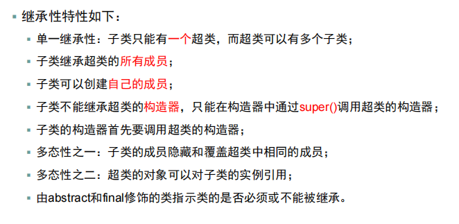

子类可以从超类中继承下来的三种成员：

- public

- protected

- 缺省

  (private继承后无法访问)

2.如何创建子类：

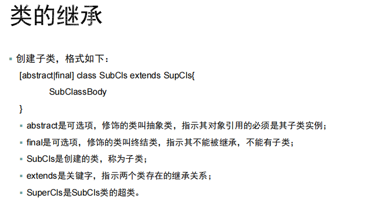

**超类对象可以引用子类实例**

3.成员变量的隐藏与方法覆盖：

子类中出现与超类相同的成员变量：超类中的成员变量被子类中的相同变量隐藏

出现与超类有相同名、同参数及同返回类型的成员方法：超类中的成员方法被子类中的成员方法所覆盖

e.g.

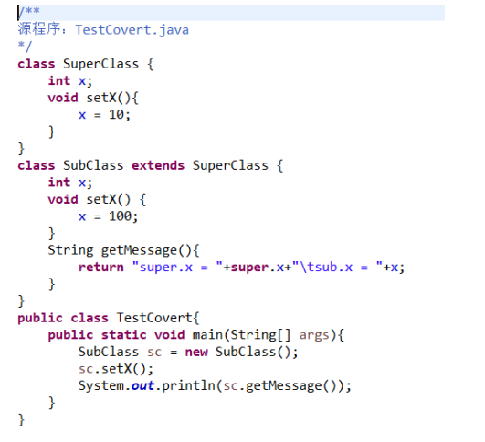

输出：super.x=0(superclass.x保持默认值0)	sub.x=100

4.null,this,super：

null:对象或数组无相应实例引用

this:表示对类的实例表示，也表示对象对该实例引用访问；在构造器中，以this（）形式表示对另一个构造器的调用

super：在子类中，通过super调用被隐藏的超类变量和被覆盖的超类方法

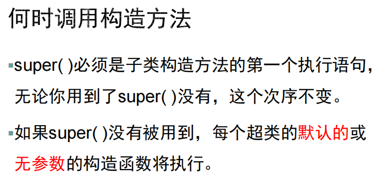

5.运行时的多态：

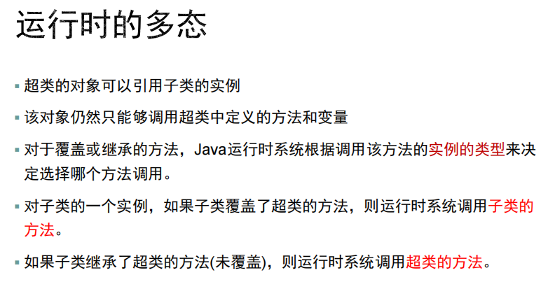

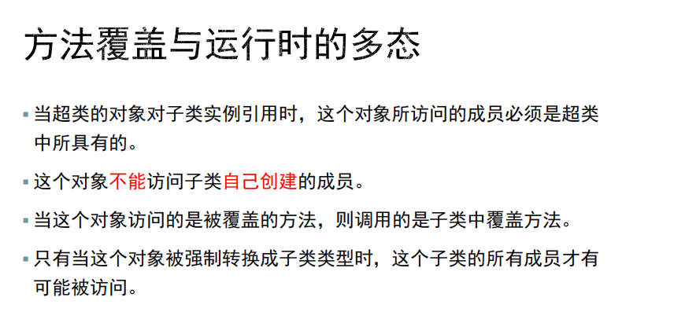

6.final,abstract,Object:

final:在一个方法内部，无法改变final参数；由final修饰的类称为终结类，不能被继承；由final修饰的方法不能被子类覆盖

abstract：当一个类的定义完全表示抽象概念，不需要被实例化为具体对象时，采用abstract；抽象类中存在未实现的抽象方法，由衍生子类时覆盖；抽象方法必须在抽象类中，但抽象类中并不都是抽象方法

不能作为抽象方法定义的方法：

- 构造方法
- 类方法
- 私有方法

Object:

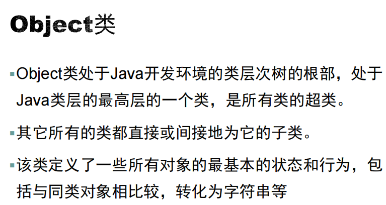

getClass():返回类的信息

toString():以字符串形式返回当前对象的有关信息

# 6

1.声明与引入：

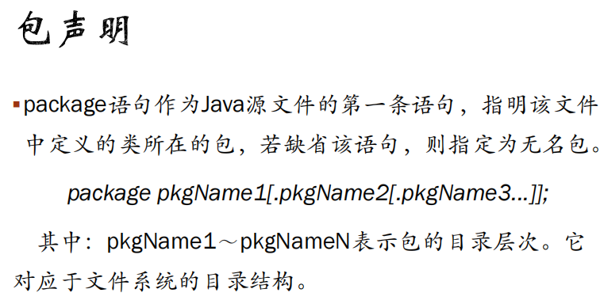

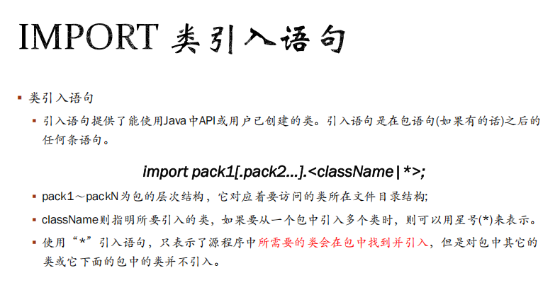

2.访问控制：

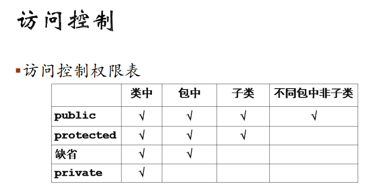

3.接口的定义实现与类型:

定义：方法定义（没有实现）和常数变量的集合

定义格式与类相似，具有成员变量和成员方法。但是**接口中的所有方法都是abstract方法**，这些方法是没有语句

（**注意正常情况下抽象方法要由abstract修饰，但接口中不需要**）

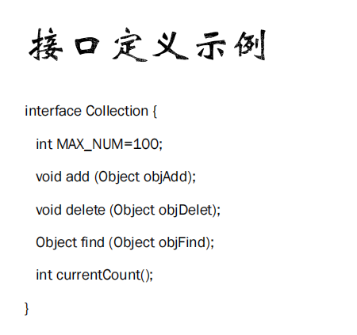

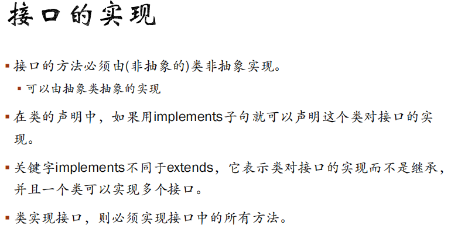

**接口可以作为一个引用类型来使用**（可以通过extends继承，要实现其中所有方法，其它与继承类一样）

补：匿名类

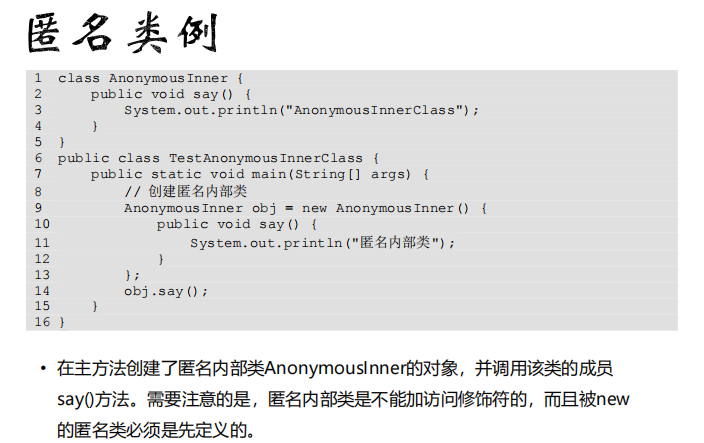

## 7

1.异常处理：不正常现象及处理

2.层次：所有异常类均属于Throwable的子类，它主要有三个基本子类：Error, Exception和RuntimeException类

try-catch-finally


e.g.

```java
//try-catch-finally:
public class test {
	public static int div(int a,int b) {
		return a/b;
	}
	public static int get() {
		int x=1015;
		try {
			x++;
			int val=div(x,0);
			System.out.println(x);
			return x;
		}catch(ArithmeticException e) {
			System.out.println("捕获到了异常");
			return x;
		}
		finally {
			x++;
			System.out.println(x);
		}
	}
	public static void main(String[] args) {
		System.out.println("返回值："+get());
	}
}
//输出为：捕获到了异常，1017，返回值：1016（调用div出现除0异常，直接转入catch进行处理，随后执行finally（此时返回值已经保存，finally中的操作不影响最终的返回值））
```


3.嵌套的异常层次：

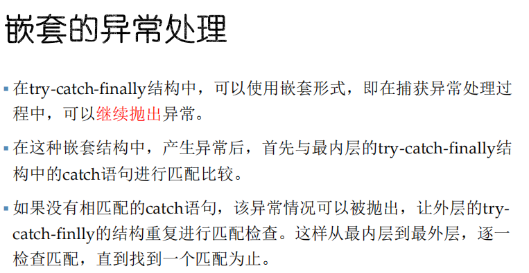

4.throw与throws及自定义异常类：
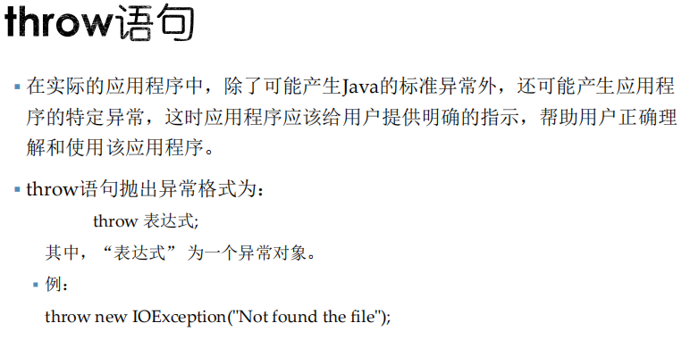

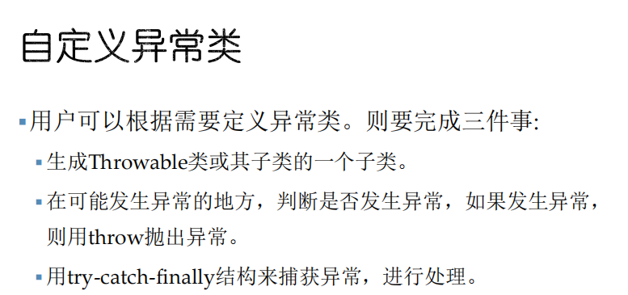

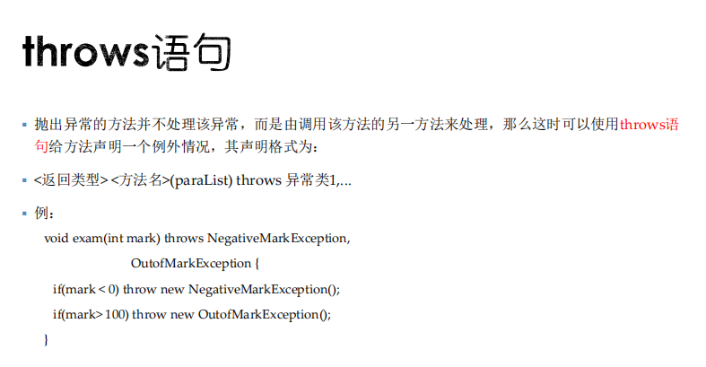

## 8

1.线程：线程就是应用程序中的一个可执行线索，多线程就是同一个应用程序中有多个可执行线索，它们可以并发执行

2.三个部分：

▪ 虚拟的CPU，封装在Java.lang.Thread类中

▪ CPU所执行的代码，传递给Thread类

▪ CPU所处理的数据，传递给Thread类

3.两种方法实现多线程：

- 生成Thread

  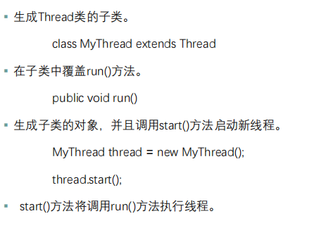

  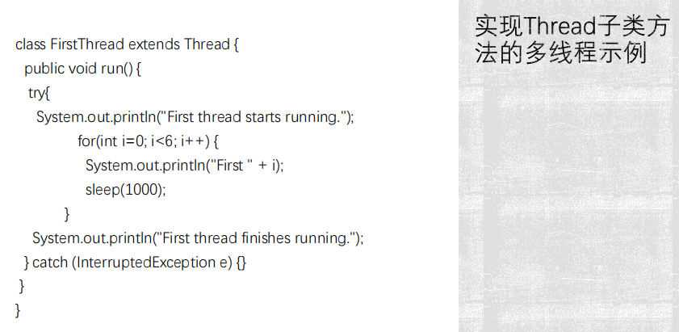

  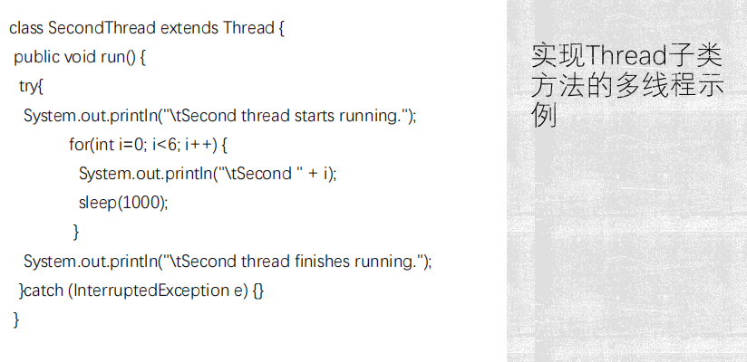

  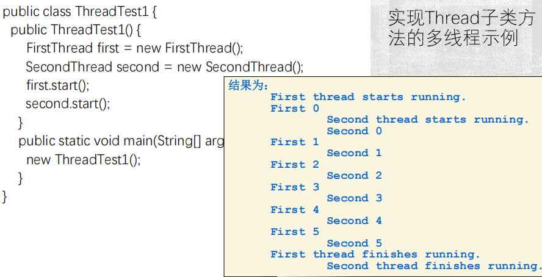

- 生成一个类，实现Runnable接口

  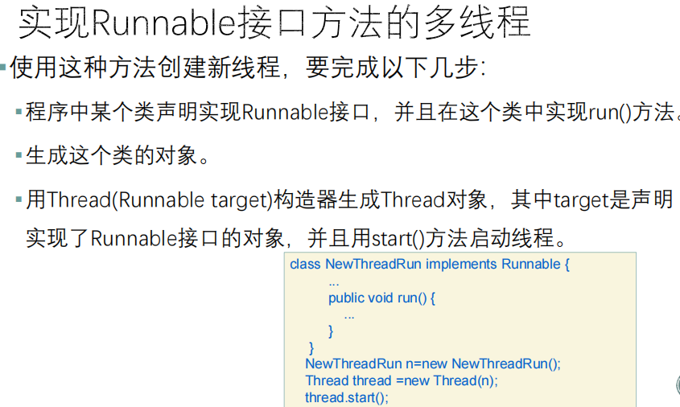

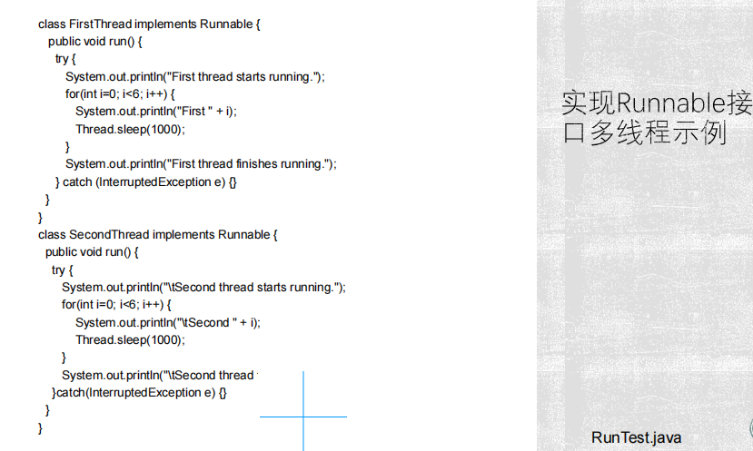

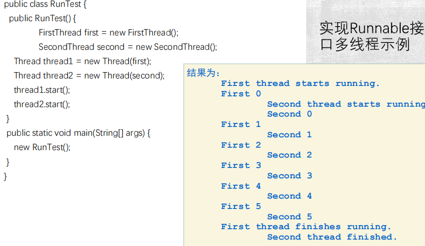

4.概念：

多线程状态：线程的状态：新生态、可执行态、阻塞态、停止态

优先级及调度：线程获得CPU而执行的优先程度（在Thread类中定义了三个优先级常量：MIN_PRIORITY, 

MAX_PRIORITY和NORM_PRIORITY，其值分别为1, 10, 5。如果应用程序没有为线程分配优先级，则Java系统为其赋值为NORM_PRIORITY。可以通过Thread类的setPriority(int a)方法来修改系统自动设置的线程优先级。）

控制：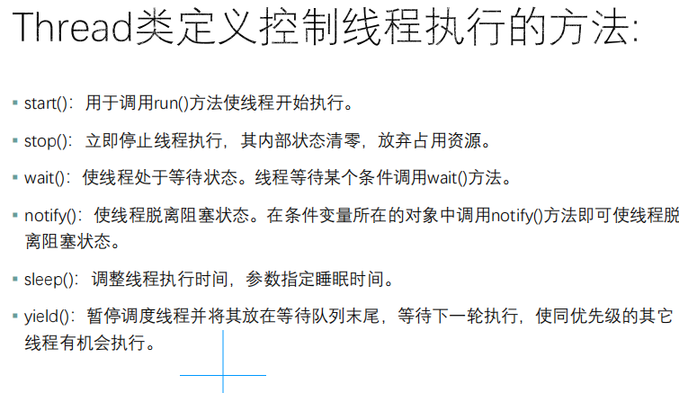

多线程同步及同步锁：

同步锁：Java用锁标志(lock flag)的手段，对被访问的数据进行同步限制，从而

实现对数据的保护。把所有被保护资源都加上锁标志，线程必须取得锁标志才能访问被保护的资源。

使用修饰符synchronized来为被保护资源加锁

线程通信：wait（）**阻塞**与notify（）**唤醒**的应用

## 9

1.流：计算机的输入与输出之间运动的数据序列；

分类：

- 输入与输出
- 字节与字符
- 节点与过滤器

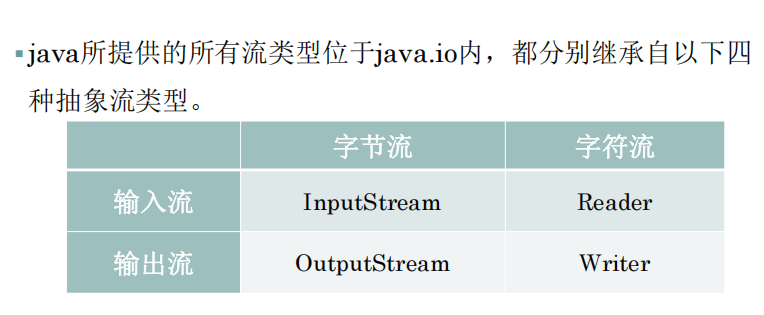

2.文件与文件IO：

File类及其主要方法

3.字节流与字符流：

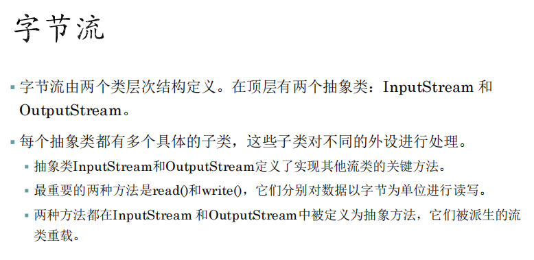

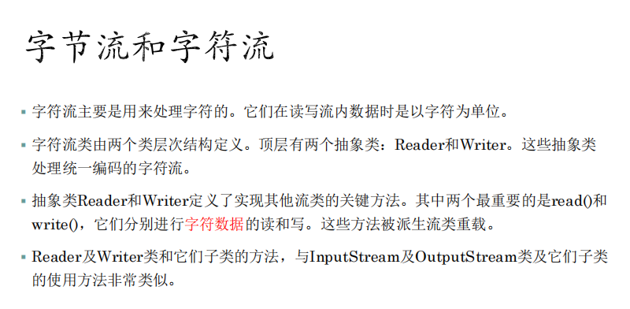

4.管道输入输出：

管道(pipe)提供一种线程之间的通信方法，可用于IPC(进程间通信) 或是ITC(线程间通信)

 一个输入管道是用来接收一个输出管道所写出的数据。


## ch1

1.软件的概念与特点：软件=程序+数据+文档

- 程序：按事先设计的功能和性能需求执行的指令序列
- 数据：使程序能正常操纵信息的数据结构
- 文档：与程序开发、维护、使用有关的图文材料

2.软件危机的概念与产生原因：

概念：在计算机软件开发和维护过程中遇到的一系列严重问题

产生原因：

- 客观：软件本身特点（逻辑部件、规模庞大）
- 主观：不正确的开发方法（忽视需求分析、错误认为：软件开发=程序编写、轻视软件维护）

3.软件工程

定义：（1）应用系统化、学科化、定量的方法来开发、运行、维护软件，即将工程运用到软件；

（2）以及对（1）中各种方法的研究

目标：在给定的时间和预算内，按照用户的需求，开发易修改、高效、可靠、可维护、适应力强、可移动、可重用的软件

三要素：工具、方法、过程


## ch2

1.软件生命周期：软件产品或软件系统从设计、投入使用到被淘汰的全过程

2.软件过程：在工作产品构建过程中，所需要完成的工作**活动、动作和任务的集合**


3.常见的软件过程模型：


(第一个软件过程模型，也称为经典生命周期模型)


（适用于系统需求明确且稳定、技术成熟、工程管理较严格的场合，如军工、航天、医疗）


(客户定义一个总体目标集，但是他们并不清楚系统的具体输入输出；或开发者不确定算法的效率、软件与

操作系统是否兼容以及客户与计算机交互的方式。此时，原型模型是很好的选择。)


(适用于软件开发中需求可能发生变化、具有较大风险、或者希望尽早进入市场的项目)


(适用于需求不明确或者需求可能发生变化的大型复杂的软件系统。支持面向过程、面向对象等多种软件开发方法，是一种具有广阔前景的模型)


敏捷开发是**基本原理与开发准则**的结合


****

## ch3

1.需求分析：确定系统必须具有的功能和性能，系统要求的运行环境，并且预测系统的发展前景

2.需求分析的过程：需求确认与需求变更


3.需求分析三类建模：


4.用例图：


用例之间的关系包括：关联、泛化、包含（include）、拓展（extend）


5.活动图：


（泳道用于划分主体）

## ch4

1.系统设计分为概要设计和详细设计

2.1抽象：忽略具体的信息把不同事物看成相同事务的过程

​	抽象机制：参数化、规范化

​	规范化抽象：• 数据抽象：描述数据对象的冠名数据集合

​							• 过程抽象：具有明确和有限功能的指令序列

2.2体系结构：软件的整体结构和这种结构为系统提供概念上完整性的方式

​	体系结构设计可以使用大量的一种或多种模型来表达

​	• 结构模型

​	• 框架模型

​	• 动态模型

​	• 过程模型

​	• 功能模型

2.3设计模式：在给定上下文环境中一类共同问题的共同解决方案

​	微观结构

​	• 实体模式

​	• 结构模式

​	• 行为模式

2.4模块化：软件被分为命名和功能相对独立的多个组件（通常称为模块），通过这些组件的集成来满足问题的需求

2.5信息隐藏：模块应该具有彼此相互隐藏的特性，即：模块定义和设计时应当保证模块内的信息（过程和数据）不可以被

不需要这些信息的其他模块访问

2.6功能独立：每个模块只负责需求中特定的子功能，并且从程序结构的其他部分看，该模块具有简单的接口

​	优点：易于开发：功能被划分，接口被简化

​				易于维护（和测试）：次生影响有限，错误传递减少，模块重用

​	定性衡量标准

• 内聚性：模块的功能相对强度

• 耦合性：模块之间的相互依赖程度

• **模块独立性强 = 高内聚低耦合**

耦合：对一个软件结构内不同模块之间互连程度的度量


尽量使用数据耦合，少用控制耦合和外部耦合，限制公共环境耦合的范围，**完全不用内容耦合**。

内聚：


事实上，没有必要精确确定内聚的级别。重要的是设计时**高内聚**，并且能够辨认出**低内聚**的模块，有能力通过修改

设计**提高模块的内聚程度并且降低模块间的耦合程度**，从而获得较高的模块**独立性**

2.7精（细）化：逐步求精的过程

与抽象的关系

• 抽象使设计师确定过程和数据，但不局限于底层细节

• 精化有助于设计者在设计过程中揭示底层细节

2.8重构：不改变组件功能和行为条件下，简化组件设计（或代码）的一种重组技术

方法：检查现有设计的冗余情况、未使用的设计元素、无效或不必要的算法、较差的构建方式或不恰当的数据结构，或任何其他可被更改从而优化设计的问题

3.设计技术：(此部分详细情况看PPT)

**系统设计从体系结构、数据、接口和组件四方面进行设计**


4.面向对象的系统设计：


与结构化设计不同，面向对象设计要注意：

• 对接口进行设计

• 发现变化并且封装它

• 先考虑聚合然后考虑继承


5.类图：


6.顺序图：


## ch5(重点为黑白盒测试)

1.软件质量：**明确表示是否符合功能和性能要求，明确地记载开发标准和所有专业开发软件的期望的隐性特点**

关键点：

- 符合明确规定的功能和性能要求

- 符合明确的开发标准

- 符合所有软件开发专业的共性、隐性标准，如易用性、可维护性等

2.


3.


4.


5.软件缺陷是指系统或系统部件中那些导致系统或部件不能实现其功能的缺陷

软件测试：在某种**指定的条件**下对系统或组件操作，观察或记录结果，对系统或组件的某些方面进行评估的过程。分析软件各项目以检测现有的结果和应有结果之间的**差异**，并评估软件各项目的特征的过程。

验证：保证软件特定开发阶段的输出已经正确完整地实现了规格说明

确认：对于每个测试级别，都要检查开发活动的输出是否满足具体的需求或与这些特定级别相关的需求


质量与可靠性：


软件测试：目标是发现软件缺陷的存在

软件调试：目标是定位与修复缺陷


6.**白盒测试与黑盒测试**


## ch6

1.项目管理四要素：


2.软件度量的方法：

- 面向规模的度量
- 面向功能点的度量